# Jack Setup

## Requirement
You need a virtual cable that I'm pretty sure you already have. 

## Software Downloads
1. [Jack](https://jackaudio.org/downloads/)
2. [Carla](https://kx.studio/Applications:Carla#Download)

## VSTs
**Some of these make you make an account, if you want I can just send you the VST to make that less annoying**
1. [Renegate](https://www.auburnsounds.com/products/Renegate.html)
2. [RNNoise](https://github.com/werman/noise-suppression-for-voice/releases)
3. [Equalizer](https://www.kvraudio.com/product/qrange-by-lkjb/downloads) (you can use whatever equalizer VST you want)
4. [TDR Feedback Compressor II](https://www.tokyodawn.net/tdr-feedback-compressor-2/)
5. [T-De-Esser](https://techivation.com/t-de-esser/)

### Rough Guide for installing VSTs
1. Prefer VST3 and always do 64 bit - 32 bit just doesn't work on modern Windows
2. Make sure they all install to `C:\Program Files\Common Files\<VST2 or VST3>` depending on whether it's a VST2 or VST3

## Configuring Windows
I'm not 100% sure what this looks like in Windows 11, but I'm sure you can get it.
1. Find your microphone/sound settings
2. Choose a sample rate for your Scarlett interface - it shouldn't really matter but I think you're generally gonna go for `2 ch, 24bit, 48000 kHz`

## Configuring Jack
1. When you install jack, you should get a program called `QjackCtl` - run that
2. Before you start the server, go to `Setup`

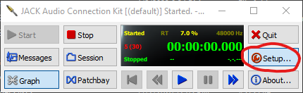

3. Make sure `Driver` is set to `portaudio`
4. Set your `Sample Rate` to the same one you set in Windows settings
5. Set your `Frames/Period` to either `512` or `1024` (those are the standard ones - I have mine on 1024, pup has 512 - not sure if it would matter for your mic)

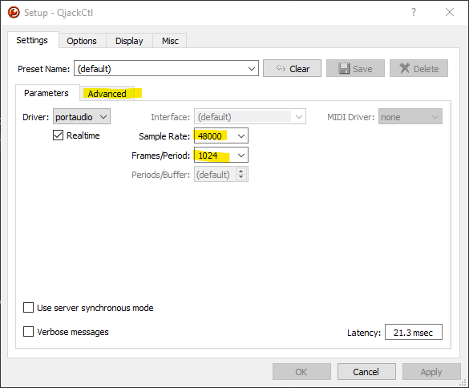

(If there's an issue with your Sample Rate or Frames/Period - you'll probably hear like little clips in your voice - basically
Windows/Jack would be going at one rate while your mic is doing another so it ends up with the kinda taking a video of a helicopter
effect where the camera sample rate is way slower than helicopter blades so you can't really see the helicopter blades
spinning properly (but in audio form)) (If that happens, I'd swap `512`/`1024` and/or change sample rate to like `44100`)

6. Go over to the `Advanced` tab
7. Set your `Input Device` to your Scarlett interface (I use the Windows DirectSound:: one)
8. Set your `Output Device` to your virtual cable (Windows DirectSound:: again)

(If you start your server later and it pops up with a message about input/output devices, cycle through the other versions)

9. Set `Channels I/O` to `1` on both input and output

This is what mine looks like:

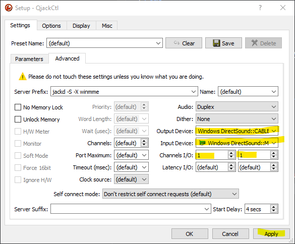
10. Apply all the settings

You'll have to come back during Carla so leave this open

## Configuring Carla
1. Start your jack server
2. Launch Carla
3. Click `Settings` then `Configure Carla`
4. Go to the `Engine` tab and make it look like mine:

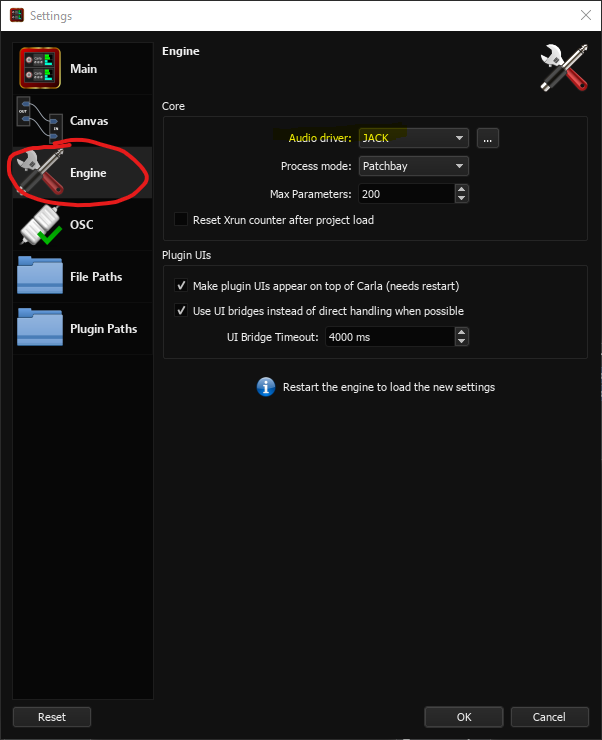

5. Go to the `Plugin Paths` tab
6. Choose VST2 in the dropdown and make sure that the `C:\Program Files\Common Files\VST2` folder is there:

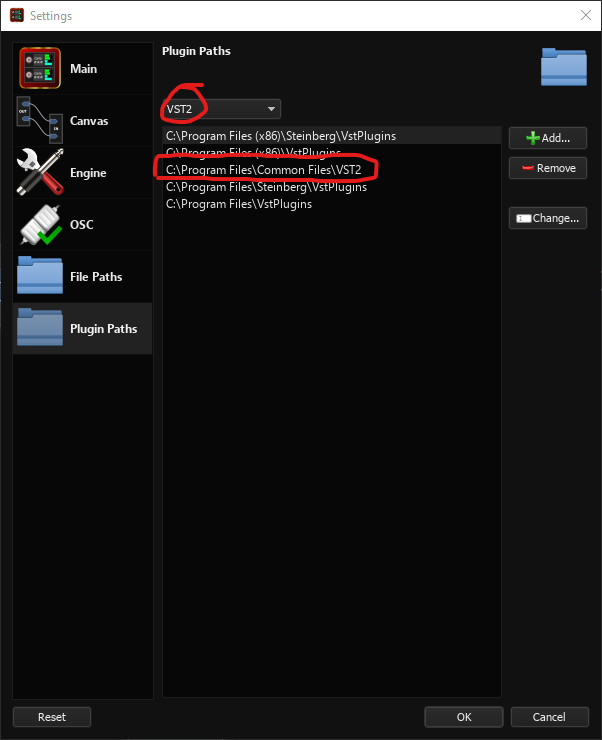

7. Do the same thing for VST3
8. Save/close settings (I think just press `Ok`)
9. Click `Engine` then click `Start`

**I could be mucking up the order of this in my memory - if Carla doesn't want to start try setting up the graph in steps 10-13 with Carla open but the Engine stopped, then start Carla**

10. In Jack, click the `Graph` button

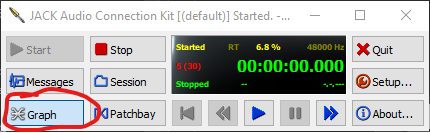

11. Hopefully, your graph should have `system` blocks on the right and left and a `Carla` block somewhere

Left `system` is your input device and right `system` is your output device. You can make connections/wires by clicking by the edge of the `capture_1` and drag a wire out to other blocks...

12. Wire the left `system`'s `capture_1` so that it has 2 wires going to Carla's `audio-in1` and `audio-in2`
13. Wire Carla's `audio-out1` and `audio-out2` to the right `system`'s `playback_1`

Hopefully, it should look like this now:

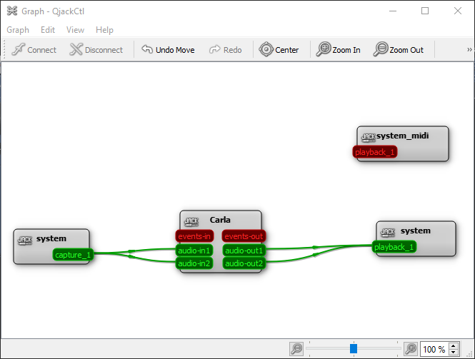

## Configuring VSTs in Carla
1. Go to the `Patchbay` tab in Carla

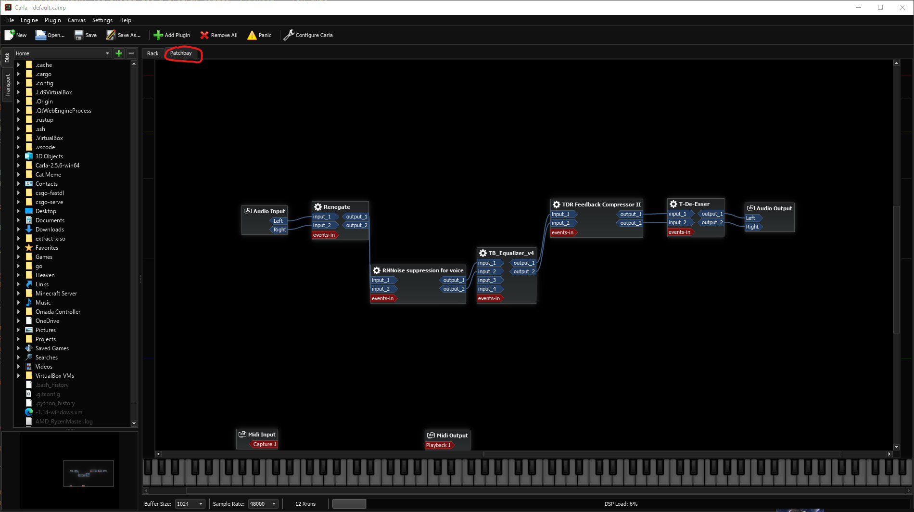

2. To make sure everything's working so far, try wiring the left and right Audio input blocks to the output blocks. If you listen to your virtual cable now, you should hear yourself.
3. Now click `Add Plugin` and refresh the `plugins` - hopefully all those VST's you downloaded should load.

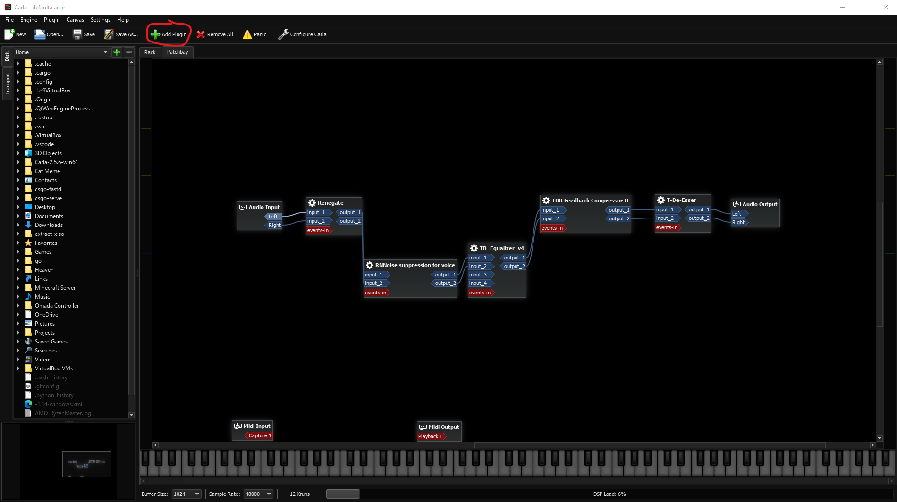

4. Add each of the plugins and wire them up to be in the order of mine (or however you want if you know better than me)

**Again prefer VST3 and 64 bit if there are multiple**

**I have an EQ I paid for, so yours will be different**

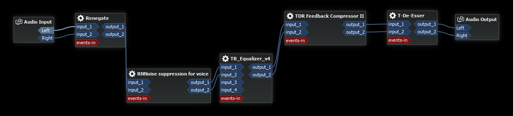

5. Follow all the VST setups below and make sure to save that somewhere you know where it is - you're going to need to load the config everytime you run Carla/start your PC.

### Renegate
Renegate is a noise gate - it basically does a super surface level cutting out noises that are below the threshold you set.

1. Double click on Renegate
2. If everything's working so far, you should see the `Detector` bar (in the pic below) moving around with noise.

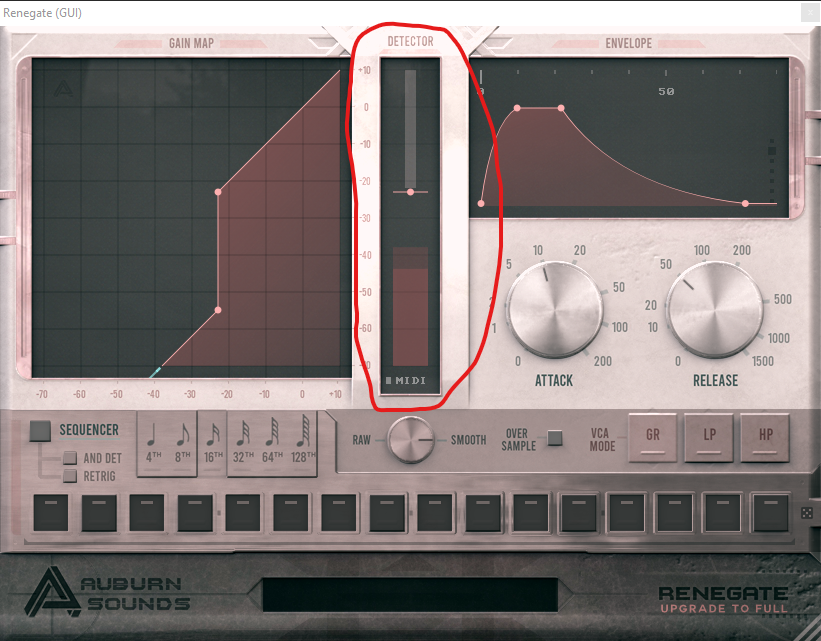

3. Try typing, smacking your desk lightly, etc. Try to set the slider bar above all those sounds but so that your voice goes above the slider whether you're whispering, talking etc (like the Discord input detection stuff)
4. For the most part, try to make your other settings (`Gain map`, `Attack`, `Release`, `Envelope`) like mine if you don't know better than the tutorials I followed.

**Quick Summary of some of the settings from my understanding**
* `Gain Map` - you're basically setting a map of if some sound is in this range of volume should the volume be increased - so something like your AC would be kinda quiet and you want to leave it quiet... your voice should be in the range where you're gain map is getting higher
* `Attack` - I think it's basically how quickly the gain map/noise gate kick in, if you set attack super high, I think you'll have more delay
* `Release` - basically a little grace period at the end of your noise - if you mumble the last word a little bit it'll probably still get picked up??
* `Envelope` - no clue tbh - looks like a model of attack and release or something?

### RNNoise
This is the same noise suppressor that OBS uses I think

1. I think you basically set `VAD Threshold` somewhere between `0.85` and `0.95` - this is how confident RNNoise should be that a sound is a voice in order to allow the sound through
2. I think you should have `VAD Grace Period` set to something like `20` just to give it some time to decide whether a sound is a voice

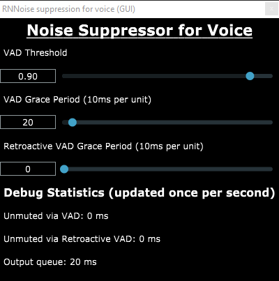

### Equalizer
EQ - I think you might know what you want for this better than me but I'll put the vague advice I remember.

1. You want to try to cut off the bottom and the top because human voice doesn't really do much between like `30-40Hz` and above like `10kHz` - so all that should just be unnecessary noise
2. I think there's generally a spot somewhere in the `300-500Hz` range that is usually a bit much - if you talk a bit and
look you should see something maybe and you want to dip that a little bit to make it more even with the rest of the frequencies
3. You could look up a guide for a more feminine voice EQ settings/vocal effects chain

Here's what mine looks like while I'm talking roughly.

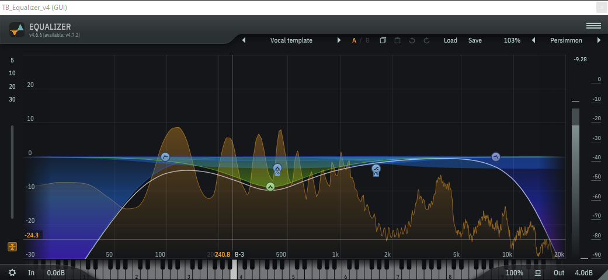

### Compressor
Compressors take your more quiet sounds and your more loud sounds and tries to even it out. If you yell you shouldn't make someone's ears bleed too
bad and if you're whispering it will hopefully make that more even so someone watching your stream or whatever doesn't have to change your volume all the time.

1. Honestly I completely forget all the details on these settings, but here's mine lol

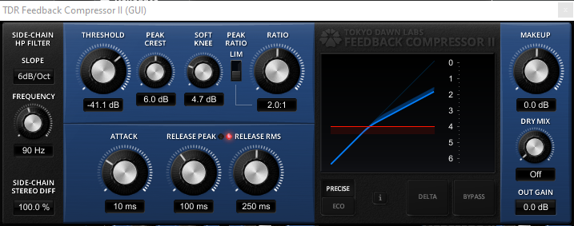

### De-Esser
De-Essers try to take away your siblance or however the fuck it's spelled - basically it should remove whistling/hissing-ish noises in `s` sounds and `th` sounds.

1. I kind of forget this too, but I think you just want to play around with the main circle dial thing and making s sounds until it sounds right-ish.

Here's mine for reference:

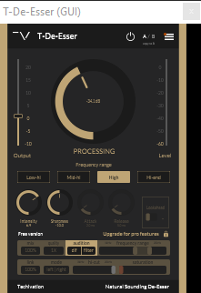

## Convenience Settings
It might be nice to make Jack and Carla start when you login and add start menu shortcuts. You can also tell Jack to start the server when you open jack, but that might break jack IDK - it worked for me for a bit then one day jack was completely broken so I turned off the setting and restarted my PC and stuff.

### Start Menu Shortcuts
1. Find where Jack/Carla are installed.
2. Make a shortcut (I think there's a right click send to desktop shortcut option if you don't know how)
3. Put the shortcut in `C:\ProgramData\Microsoft\Windows\Start Menu\Programs` (I think it's the same for Windows 11 but if not google) (also you should be able to type that in the file browser or enable viewing hidden files and directories to see that folder because it's hidden by default)

### Running at Startup
1. Hit `Windows+R` or type `Run` in the start menu
2. In the window that pops up, type `shell:startup` and hit `Enter`
3. Copy shortcuts there too

### Jack Start Server
1. The option lives in Jack's `Setup` menu on the `Misc` tab

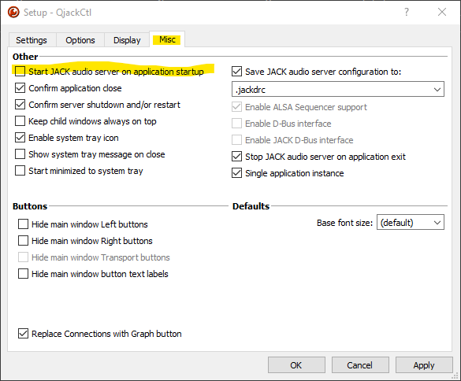

## Normal Running (what to do everytime you restart now/troubleshooting)

### Program Order
Whenever you are starting everything, do this order:
1. Open jack and click `Start` to start the jack server
2. Open Carla if it's not already open and go to `Engine` -> `Start`
3. In Carla, click `Open` and load your VST configuration that you saved

### Troubleshooting
Occasionally you just get crunchy or delayed for some reason kinda like in OBS. I think it's usually only when you leave your PC running/sleep it cause it usually will stay normal while I'm actually hanging out. When that happens:

1. Stop Carla
2. Stop Jack
3. Restart everything like you would normally

Sometimes I'll notice my discord icon just get pinned to lit up (and no one can hear me) - do the same thing for that.
**Sometimes when you load the config Carla will randomly crash - just do it again and it usually works**
